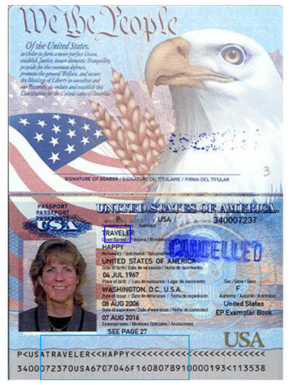

# Retinanet_and_tesseract
Repository of flask web application for detection and recognition of objects from USA documents
 
-To view how to load and train model visit notebooks
-To run Docker image visit:
 https://drive.google.com/file/d/1NYBT6zcm5Eux2rCRb2qsU5dScSIWZzn1/view?usp=sharing
 Load pretained model and put it to flask_app/models/

## Important
